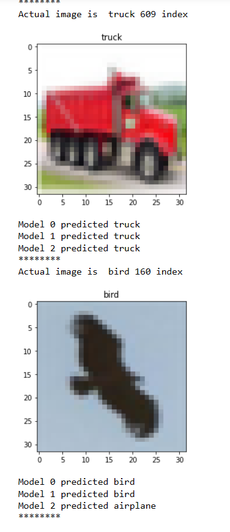

# Training The Model

## Installing the dependencies

`conda create -n cifar10`
`pip install tensorflow tensorflow-gpu opencv-python os matplotlib seaborn`
`jupyter notebook`


> Cifar10 is a dataset of 50,000 32x32 color training images and 10,000 test images, labeled over 10 categories. See more info at the
> [CIFAR homepage](https://www.cs.toronto.edu/~kriz/cifar.html)

Turns out that the images are already splitted

> The classes of the datasets are
> `classes = ["airplane","automobile","bird","cat","deer","dog","frog","horse","ship","truck"]`
> 

## Plotting the image

Image can be plotted with `matplotlib` library

The weird part is the image looks like Japanese video 😂😂😂

## Pre-processing the data

1.  Normalizing The Image's Arra
2.  Reshapping the y to fit into the model

# Architecture

***The most important part of the project is*** **CNN Model**

- The efficiency is tested with three different models

# Model 0

- This is the first model which has

1.  Convolutional Layer with 16 filters of size (3,3)
2.  MaxPooling
3.  Convolution Layer with 32 filters of (3,3) size with stride = 1
4.  MaxPooling
5.  Flatten
6.  Fully Connected Layer with neurons =256
7.  Final Output Layer with sigmoid activation


`model.add(Conv2D(16, (3,3), 1, activation='relu', input_shape=(32,32,3)))`

- $$
    \lfloor \frac{n-f+2p}{s} +1\rfloor
    
    $$
    
- Here n = 32 ,f =3 ,p =0 ,s=1
- $$
    \lfloor \frac{32-3}{1} +1\rfloor
    
    $$
    
- 30 is the width of the output layer of the first convolutional layer
- `activation = 'relu'` is the rectified linear unit which
- $$
    f(x) = max(0,x)
    
    $$
    
- 
- **Parameters**
- First parameter =

$$
((3*3*3)+1)*16 = 448

$$


- For **maxpooling**
- $$
    \lfloor \frac{254}{2}\rfloor =127
    
    $$
    
- There wont be parameter for the max pooling.

## For second conv2D

`model.add(Conv2D(32,(3,3),1,activation='relu'))`
means that **32** 3*3 filters of RGB(3) channels have stride =1

- $$
    \lfloor \frac{n-f+2p}{s} +1\rfloor
    
    $$
    
- Here n = 127 ,f =3 ,p =0 ,s=1
- $$
    \lfloor \frac{127-3}{1} +1\rfloor
    
    $$
    
- 125 is the width and height of its output layer
- The chanels would be 32
- Hence, the output shape =(None,125,125,32)
    **Parameters**

$$
((f_{H}*f_{W}*n^{[C-1]})+1)*n^{[C]} 

$$

$$
((3*3*16)+1)*32=4640

$$

### For max pooling

- $$
    \lfloor \frac{125}{2}\rfloor =62
    
    $$
    

## For third conv2D

`model.add(Conv2D(64,(3,3),1,activation='relu'))`
means that **64** 3*3 filters of RGB(3) channels have stride =1

- $$
    \lfloor \frac{n-f+2p}{s} +1\rfloor
    
    $$
    
- Here n = 62 ,f =3 ,p =0 ,s=1
- $$
    \lfloor \frac{62-3}{1} +1\rfloor
    
    $$
    
- 60 is the width and height of its output layer
- The chanels would be 64
- Hence, the output shape =(None,60,60,64)
    **Parameters**

$$
((f_{H}*f_{W}*n^{[C-1]})+1)*n^{[C]} 

$$

$$
((3*3*32)+1)*64=18496

$$

`dense_17`

$$
Parameters = 256*256+256*1 = 65792

$$

`dense_18`

$$
Parameters = 256*10+10*1 = 2570

$$

`model.compile('adam',loss='sparse_categorical_crossentropy',metrics=['accuracy'])`
**Adaptive Moment Estimation Algorithm** optmiizer is used with loss = sparse\_categorical\_entropy


***model 1 and model 2 have same architecture but they differ on the architecture only***

# Model 1


# Model 2


```model_name.add(Conv2D(8,
    model_name.add(MaxPooling2D())
    model_name.add(Conv2D(16,(3,3),1,activation='relu'))
    model_name.add(MaxPooling2D())
    model_name.add(Conv2D(32,(3,3),1,activation='relu'))
    model_name.add(MaxPooling2D())
    model_name.add(Flatten())
    model_name.add(Dense(3000,activation='relu'))
    model_name.add(Dense(1000,activation='relu'))
    model_name.add(Dense(10,activation='softmax'))
```

Model is saved and loaded to/from the disk

```
model.save(os.path.join('models','model.h5'))
model = load_model(os.path.join('models','model.h5'))**strong text**
```


***GitHub allows upto 100 MB files so the h5 files cant be included but please let me know if you need this**

# Testing the result 😊😊

| Parameter | Model 0 | Model 1 | Model 2 |
| --- | --- | --- | --- |
| Accuracy After 10th | 0.7955 | 0.7925 | 0.5813 |
| Loss After 10th epoch | 0.5730 | 0.5719 | 1.1919 |
| Parameters | 91,946 | 3,404,042 | 3,404,042 |

# Randomly testing with test-images



## Graph of accuracy and loss 

Graph For accuracy

## Confusion Matrix


My favourite part is testing with new images typically


The model does have error
***Fun Thing I did was even though there is not class for a human I wanted to know how it will classify my image*** 

🥁🥁🥁 

TURNS OUT I'M A TRUCK🚚🚚
