**readme**

**Training The Model**

**Installing the dependencies**

conda create -n cifar10

pip install tensorflow tensorflow-gpu opencv-python os matplotlib seaborn jupyter notebook

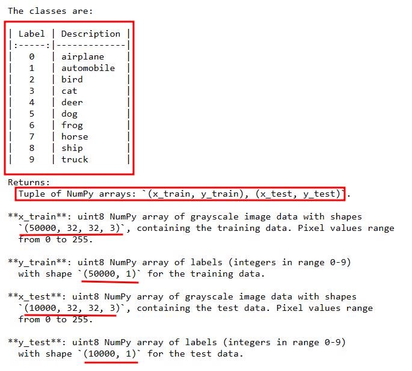

Cifar10 is a dataset of 50,000 32x32 color training images and 10,000 test images, labeled over 10 categories. See more info at the

CIFAR homepage

Turns out that the images are already splitted

The classes of the datasets are

classes =

||["airplane","automobile","bird","cat","deer","dog","frog","horse","ship","tru||
| :- | - | :- |
|||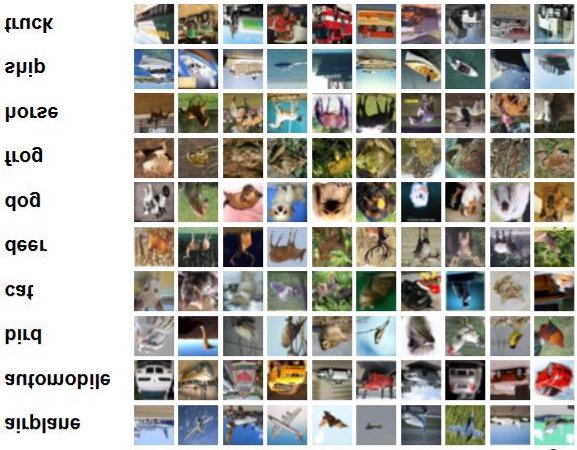||
||ck"]|||
||||
**Plotting the image**

Image can be plotted with matplotlib library

**The weird part is the image looks like Japanese video** 😂😂😂

**Pre-processing the data**

1. Normalizing The Image's Arra
1. Reshapping the y to fit into the model

**Architecture**

- Here n = 32 ,f =3 ,p =0 ,s=1

32 − 3

- + 1⌋ 1

***The most important part of the project is*** **CNN Model**

 The efficiency is tested with three different models

**Model 0**

 This is the first model which has

1. Convolutional Layer with 16 filters of size (3,3)
1. MaxPooling
1. Convolution Layer with 32 filters of (3,3) size with stride = 1
1. MaxPooling
1. Flatten
1. Fully Connected Layer with neurons =256
1. Final Output Layer with sigmoid activation

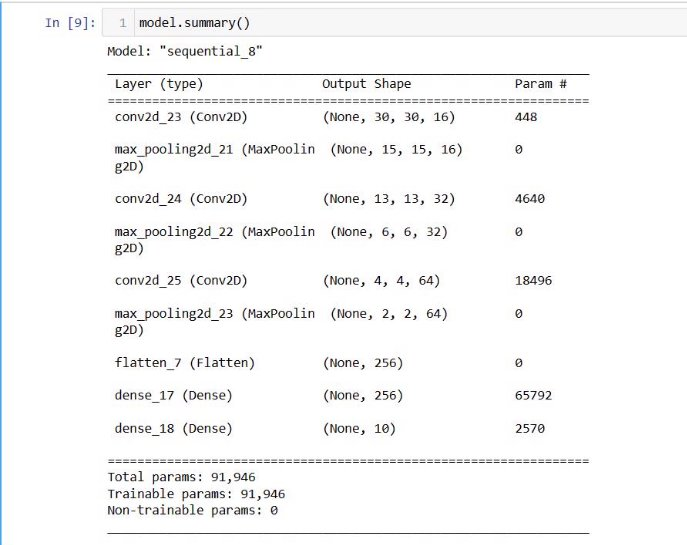

model.add(Conv2D(16, (3,3), 1, activation='relu', input\_shape=(32,32,3)))

- 30 is the width of the output layer of the first convolutional layer
  - activation = 'relu' is the rectified linear unit which
    - *f* (*x*) = *max*(0,*x*)

 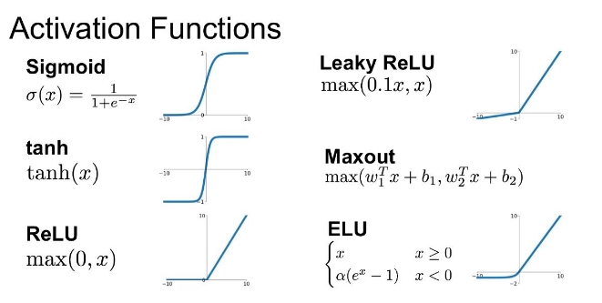

**Parameters**

 First parameter = $$((3*3*3)+1)\*16 = 448$$

 For **maxpooling**

254

- ⌋= 127 2

 There wont be parameter for the max pooling.

**For second conv2D**

model.add(Conv2D(32,(3,3),1,activation='relu'))

means that **32** 3\*3 filters of RGB(3) channels have stride =1

*n* − *f* + 2*p*

⌊~~ + 1⌋ *s*
- Here n = 127 ,f =3 ,p =0 ,s=1

127 − 3

- + 1⌋ 1
- 125 is the width and height of its output layer
  - The chanels would be 32
    - Hence, the output shape =(None,125,125,32) **Parameters**

((*fH* ∗*fW* ∗*n*[*C*−1]) + 1) ∗*n*[*C*]

((3 ∗3 ∗16) + 1) ∗32 = 4640

**For max pooling**

125

- ⌋= 62 2

**For third conv2D**

model.add(Conv2D(64,(3,3),1,activation='relu')) 

means that **64** 3\*3 filters of RGB(3) channels have stride =1

*n* − *f* + 2*p*

- + 1⌋ *s*

 Here n = 62 ,f =3 ,p =0 ,s=1

62 − 3

- + 1⌋

1

- 60 is the width and height of its output layer
  - The chanels would be 64
    - Hence, the output shape =(None,60,60,64) **Parameters**

((*f* ∗*f* ∗*n*[*C*−1]) + 1) ∗*n*[*C*]

*H W*

((3 ∗3 ∗32) + 1) ∗64 = 18496

dense\_17

*Parameters* = 256 ∗256 + 256 ∗1 = 65792

dense\_18

*Parameters* = 256 ∗10 + 10 ∗1 = 2570                          model.compile('adam',loss='sparse\_categorical\_crossentropy',metrics=['accuracy'])

**Adaptive Moment Estimation Algorithm** optmiizer is used with loss = sparse\_categorical\_entropy

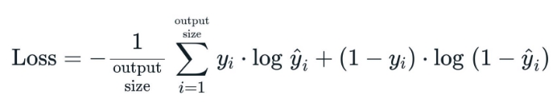

***model 1 and model 2 have same architecture but they differ on the architecture only***

**Model 1**

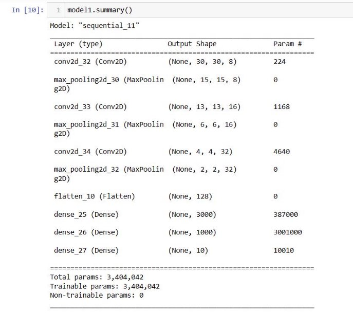

**Model 2**

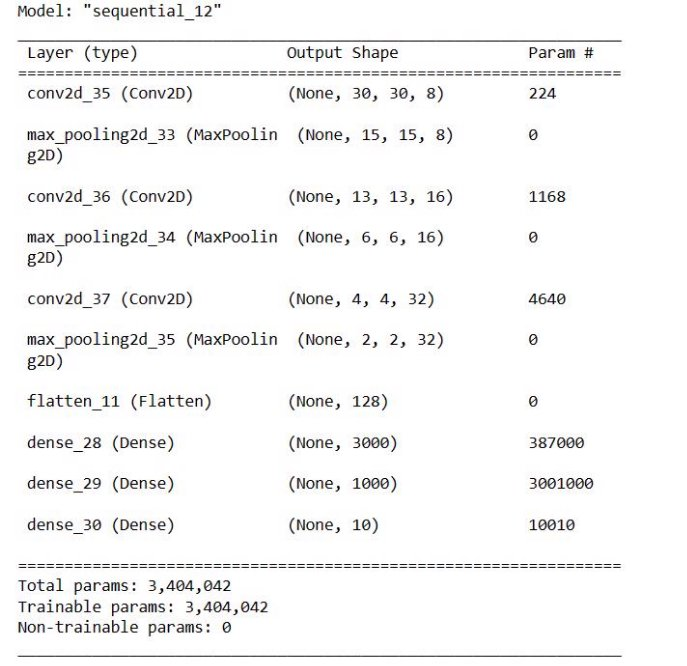

`    `model\_name.add(MaxPooling2D()) 

`    `model\_name.add(Conv2D(16,(3,3),1,activation='relu'))     model\_name.add(MaxPooling2D()) 

`    `model\_name.add(Conv2D(32,(3,3),1,activation='relu'))     model\_name.add(MaxPooling2D()) 

`    `model\_name.add(Flatten()) 

`    `model\_name.add(Dense(3000,activation='relu')) 

`    `model\_name.add(Dense(1000,activation='relu')) 

`    `model\_name.add(Dense(10,activation='softmax'))

Model is saved and loaded to/from the disk

model.save(os.path.join('models','model.h5'))

model = load\_model(os.path.join('models','model.h5'))\*\*strong text\*\*

***GitHub allows upto 100 MB files so the h5 files cant be included but please let me know if you need this***

**Testing the result** 😊😊

**Parameter Model 0 Model 1 Model 2 **Accuracy After 10th 0.7955 0.7925 0.5813 Loss After 10th epoch 0.5730 0.5719 1.1919 Parameters 91,946 3,404,042 3,404,042

**Randomly testing with test-images**

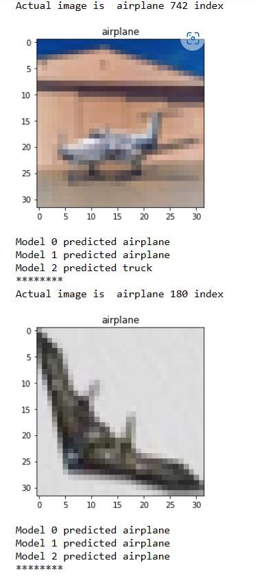

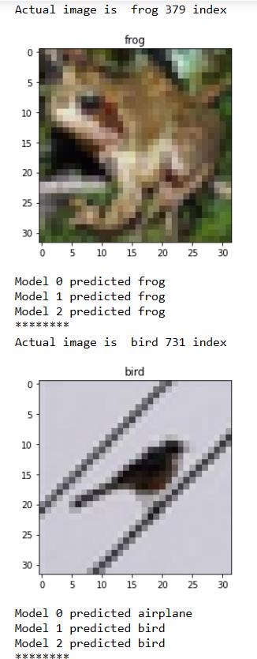

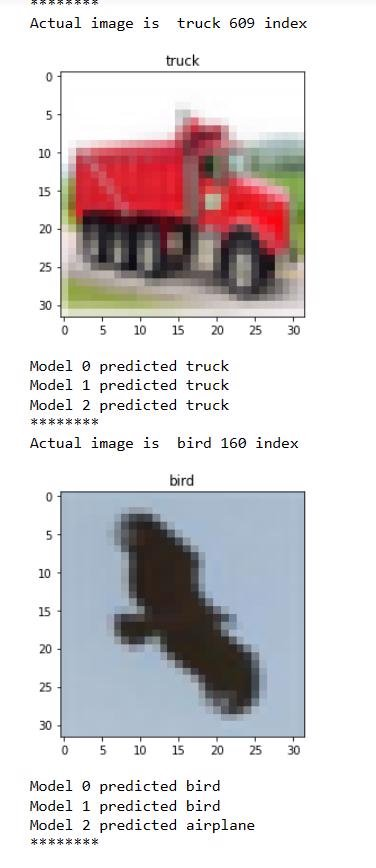

**Graph of accuracy and loss**

Graph For accuracy

 Model 0 seems to be appropriate one

**Confusion Matrix**

**My favourite part is testing with new images typically**

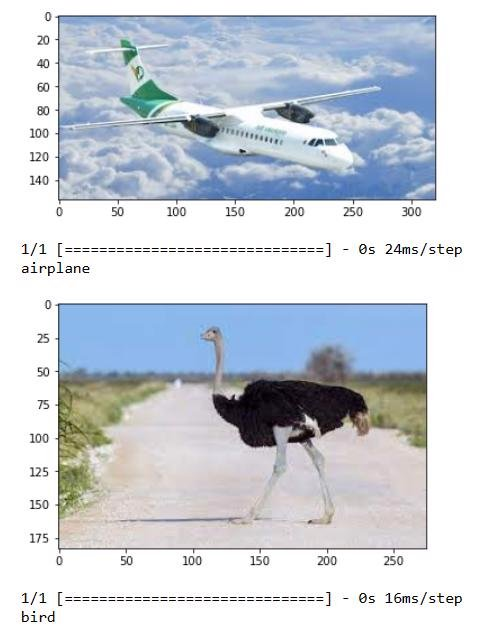

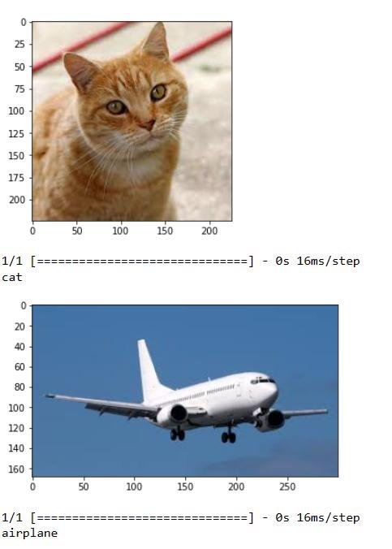

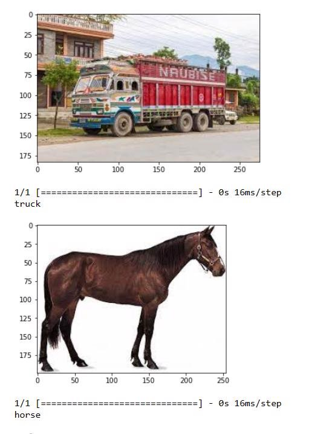

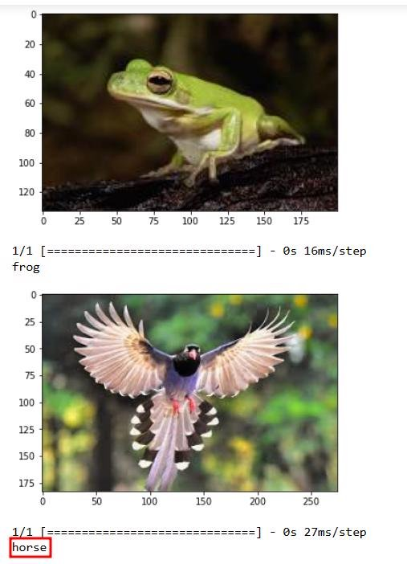

**The model does have error**

***Fun Thing I did was even though there is not class for a human I wanted to know how it will classify my image***

🥁🥁🥁

TURNS OUT I'M A TRUCK🚚🚚
